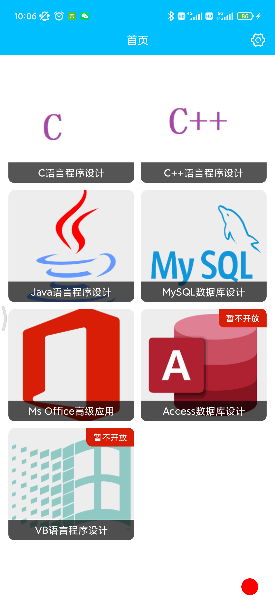
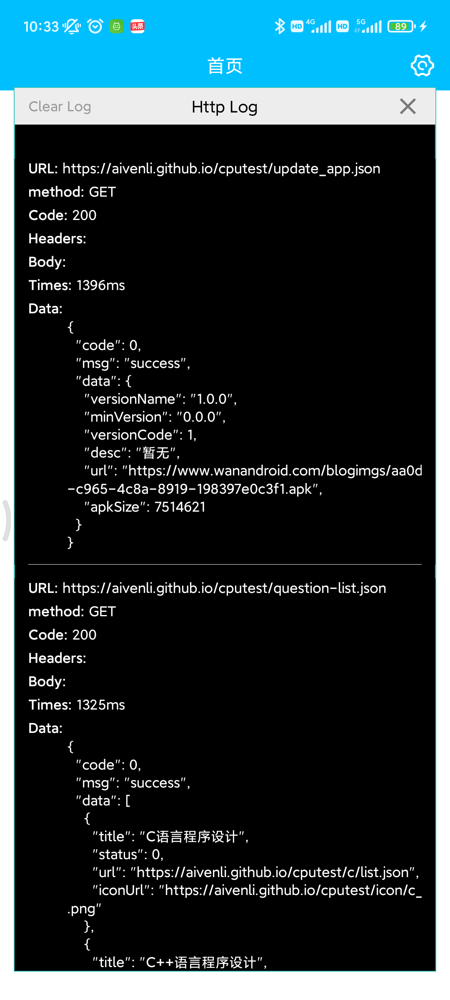

## Http-Float-Log


&emsp;&emsp;该库用于查看app的http请求日志，集成后可直接在app中查看。效果如下：



图中有个小红点，点击小红点即可查看http请求日志，如下图：




### 一、说明


&emsp;&emsp;请求日志只会保留最新的50条请求，当然，您也可以直接点击上图中的“Clear Log”来清空日志。


### 二、集成


&emsp;&emsp;复制该模块到您的项目中，然后在“setting.gradle"文件中添加：

```xml
include ':http-float-log'
```


然后再在app模块下的”build.gradle“中添加：

```xml
implementation project(path: ':http-float-log')
```


最后点击Android studio右上角的”Sync now“同步即可完成集成。


但是如果不出意外的话，集成时会报错，错误原因是因为该模块下的”build.gradle"有问题，如下：

```xml
implementation rootProject.ext.dependencies.retrofit
implementation rootProject.ext.dependencies.gson
```

该模块需要添加retrofit和gson依赖库。为了使整个项目使用的库保持同一版本，建议使用这种写法，具体请参考本项目。当然您也可以直接删掉上述两行依赖，然后添加：

```xml
implementation "com.squareup.retrofit2:retrofit:2.9.0"
implementation "com.google.code.gson:gson:2.8.9"
```

但是如果您的其他模块的retrofit和gson版本不一样的话，可能会出现一些问题。


### 三、使用


**Step 1. 添加Application**

&emsp;&emsp;在您的App模块下新建一个类并继承"FloatApp"类，然后再清单文件（AndroidManifest.xml）中指定您新建的这个类为Aplication启动类。即在Application节点下新增如下代码：

```xml
android:name=".app.App"
```

其中App是新建的类，app是包名


**Step 2. 添加浮窗权限**

&emsp;&emsp;在您的首页（App启动后的第一个Activity）添加如下代码：

```kotlin
override fun onCreate(savedInstanceState: Bundle?) {
	super.onCreate(savedInstanceState)
	if (!Settings.canDrawOverlays(this)) {
		val intent =
                Intent(Settings.ACTION_MANAGE_OVERLAY_PERMISSION, Uri.parse("package:$packageName"))
        startActivityForResult(intent, 10000)
	} else {
		val floatManager = FloatManager.getInstance(this)
		floatManager.startFloat()
		floatManager.setFloatViewVisible()
	}
}

override fun onActivityResult(requestCode: Int, resultCode: Int, @Nullable data: Intent?) {
	super.onActivityResult(requestCode, resultCode, data)
	if (requestCode == 10000 && Settings.canDrawOverlays(this)) {
		val floatManager = FloatManager.getInstance(this)
		floatManager.startFloat()
		floatManager.setFloatViewVisible()
	}
}
```

其实就是申请浮窗权限，App第一次启动时，会自动跳转获取浮窗权限，点击允许方可使用。


**Step 3. 添加Http拦截器**


&emsp;&emsp;在您的Retrofit中添加拦截器，代码如下：

```kotlin
private fun getOkhttpClient(): OkHttpClient {
        return OkHttpClient.Builder()
            .connectTimeout(TIME_OUT, TimeUnit.MILLISECONDS)
            .readTimeout(TIME_OUT, TimeUnit.MILLISECONDS)
            .addInterceptor(com.aiven.hfl.LogInterceptor(FloatManager.getInstance(null).handler))
            .build()
}
```


**完成上述三个步骤后就可以愉快的使用了。**